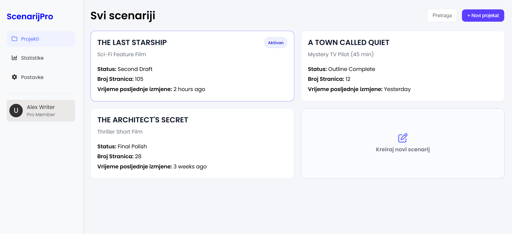
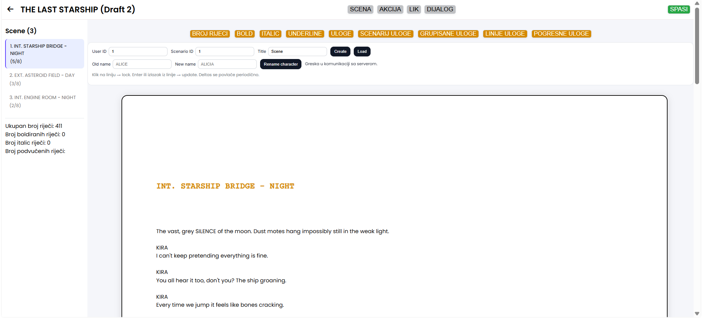
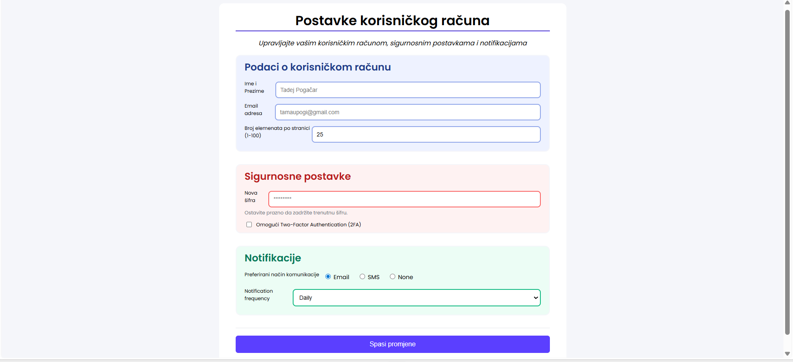

# 🎬 ScenarijPro

**ScenarijPro** is a web-based screenplay writing and project management application designed for writers to create, edit, and track screenplay drafts with real-time change monitoring.

The application allows users to manage multiple writing projects, edit scenes, track text changes, and organize screenplay elements such as scenes, dialogue, and characters.

The core system logic is implemented inside **`writing.html`**, where API routes and database communication are defined for tracking writing activity and document changes.

---

## ✨ Features

### 📂 Project Management
- Create and manage screenplay projects
- Track project status and drafts
- Display screenplay metadata (pages, last modification time)

### ✍️ Screenplay Editor
- Scene-based writing interface
- Dialogue and action formatting
- Character renaming
- Text styling:
  - Bold
  - Italic
  - Underline

### 📊 Change Tracking System
- Word count tracking
- Formatting statistics
- Periodic change synchronization
- Writing activity monitoring

### 👤 User Account Settings
- Profile management
- Security settings
- Two-Factor Authentication (2FA)
- Notification preferences

---

## 🧠 Core Component — `writing.html`

The **main logic of the application** is implemented in:
writing.html

This file handles:

- API communication
- Scene editing logic
- Change tracking
- Character updates
- Database synchronization

### Responsibilities

- Defines API routes used by the editor
- Sends writing updates to backend services
- Tracks user edits in real time
- Communicates with MySQL database

---

## 🗄️ Database (MySQL)

The application uses a **MySQL database** to store:

- Users
- Projects
- Scenes
- Characters
- Text changes
- Writing statistics

Change tracking allows monitoring of:

- word counts
- formatting usage
- editing history

---

## 🔌 API Routes

The editor communicates with backend endpoints responsible for:

- loading scenes
- saving updates
- renaming characters
- syncing changes
- retrieving statistics

Example operations:

- `LOAD scene`
- `CREATE scene`
- `UPDATE content`
- `RENAME character`

---

## 🛠️ Technologies Used

- HTML5
- CSS3
- JavaScript
- MySQL
- REST API architecture

---

## 📸 Screenshots

  
  
  

---

